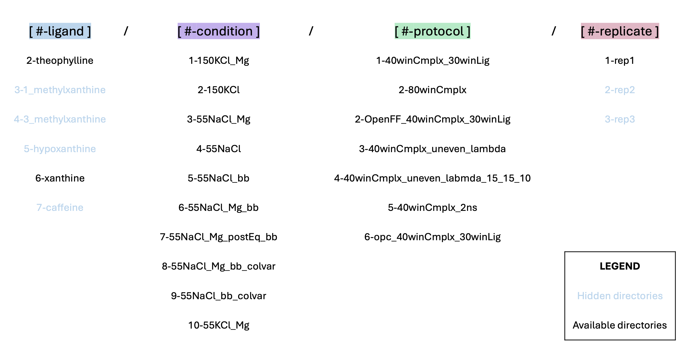

# Free energy calculations with RNA model with zero or two Mg2+ ions

This directory contains equilibration and alchemical free energy calculations of theophylline and its analogs using BFEE2 Alchemical Route.


## Directory Map ##

Directories were organized using the following structure:  `[#-ligand]/[#-condition]/[#-protocol]/[#-replicate]/`.
eg. For example the first replicate of the simulations of theophylline with RNA aptamer with 55 mM NaCl condition and 2 structural Mg2+ ions with our default alchemical protocol can be found in this path: `2-theophylline/3-55NaCl_Mg/1-40winCmplx_30winLig/1-rep1/`.



We performed free energy calculations for all six ligands mentioned in the manuscript, however only directories of theopylline and xanthine are provided in this repository as examples (`2-theophylline/` and `6-xanthine/`). The setup of calculations of other analogs was exactly the same as the steps for xanthine. 

All free energy calculations were run as three independent replicates. Here, we provided the input files and scripts for only the first replicate (`1-rep1/`) to limit repository size. The other replicates were originally organized under separate directories in the same location (`2-rep2/` and `3-rep3/`).

For the "1-rna_only" system, only the equilibration was done to check if the RNA undergoes large conformational changes without the bound ligand or not.

```
.
├── 1-rna_only                                          : directory for equilibration of RNA-only system 
├── 2-theophylline                                      : system directory for RNA-ligand complexes named by ligands
│   ├── 1-150KCl_Mg                                     : condition director (salt and Mg)
│   │   ├── 1-40winCmplx_30winLig                       : alchemical protocol directory (number of labda windows)       						
│   │   │   ├── 1-rep1					: replica directory
│   │   │   │   └── 0-starting_PDB			: input PDB from RCSB database
│   │   │   │   └── 1-sys_prep  			: system preparation files
│   │   │   │   └── 2-sim_run   			: simulation directory
│   │   │   │   │   └── restraints 			: solute restraints file
│   │   │   │   │   └── equ_0   			: initial minmization and solute restrained simul.
│   │   │   │   │   └── equ_1   			: gradual release of the solute restraints
│   │   │   │   │   └── equ_2   			: unrestrained 100 ns equilibration
│   │   │   │   │   └── ini   				: pdb and psf after 100 ns equilibration to input to BFEE2
│   │   │   │   │   └── BFEE    			: BFEE files for alchemical free enegy calc.
│   │   │   │   │   ├── 001_MoleculeBound		: bound state : Forward-backward FEP calculations
│   │   │   │   │   │   └── output
│   │   │   │   │   ├── 002_RestraintBound		: bound state : TI for restraint contributions
│   │   │   │   │   │   └── output
│   │   │   │   │   ├── 003_MoleculeUnbound		: unbound state : forward-backward FEP calculations
│   │   │   │   │   │   └── output
│   │   │   │   │   └── 004_RestraintUnbound		: unbound state : TI for restraint contributions
│   │   │   │   │       └── output
│   │   ├── 2-80winCmplx                                : 80 windows for ligand-bound system
│   │   │   ├── 2-rep2					: next replica
.	.	.
│   ├── 2-150KCl                                        : next condition
.	.	.                                   
├── 6-xanthine                                           : next system with a different ligand
.	.	.    
├── 8-rna_RMSD_colvar_contr            : RNA only system for calculating contributions of RNA backbone restraints
├── common_files                       : common files and script templates are kept here
├── automation_scripts                 : scripts for setting up a group of calculations all at once
├── analysis                           : analysis of free energy calculations
│   ├── BFE_pandas                     : analysis of binding free energy predictions vs experiment
│   │   ├── analysis.ipynb             : calculate final estimates and plot predicted vs experimental free energies
│   ├── RDF                            : analysis of monovalent cation distribution
├── results                            : common files and scripts templates are kept here
│   ├── BFE_with_failed                : BFEE free energy results after removal of rejected replicates
│   ├── accept_reject_files            : Paths to free energy calculations of accepted and rejected replicates
│   ├── dU_plot                        : plotting prob. dist. function overlap of potential-energy differences (DeltaU)
```


## Simulated systems and conditions ##
<!-- 2-theophylline:     Conditions: {1-150KCl_Mg, 2-150KCl, 3-55NaCl_Mg, 4-55NaCl, 5-55NaCl_bb, 6-55NaCl_Mg_bb, 7-55NaCl_Mg_postEq_bb}
                    Replicas:   {1-rep1, 2-rep2, 3-rep3}
3-1_methylxanthine: Conditions: {1-150KCl_Mg}
                    Replicas:   {1-rep1, 2-rep2, 3-rep3}                
4-3_methylxanthine: Conditions: {1-150KCl_Mg}
                    Replicas:   {1-rep1, 2-rep2, 3-rep3} 
5-hypoxanthine:     Conditions: {1-150KCl_Mg}
                    Replicas:   {1-rep1, 2-rep2, 3-rep3}
6-xanthine:         Conditions: {1-150KCl_Mg, 2-150KCl, 3-55NaCl_Mg, 4-55NaCl, 5-55NaCl_bb, 6-55NaCl_Mg_bb, 7-55NaCl_Mg_postEq_bb}
                    Replicas:   {1-rep1, 2-rep2, 3-rep3}
7-caffeine:         Conditions: {1-150KCl_Mg, 2-150KCl, 3-55NaCl_Mg, 4-55NaCl, 5-55NaCl_bb, 6-55NaCl_Mg_bb, 7-55NaCl_Mg_postEq_bb}
                    Replicas:   {1-rep1, 2-rep2, 3-rep3} -->


### Ligands ###
| Directory Name      | Ligand                | Binding pose source                        | Charge   | 
| :----:              |    :----:             |    :----:                                    |  :----:    |
| 2-theophylline       | theophylline         | NMR structure of the complex                 | 0 |                                    
| 3-1_methylxanthine  | 1-methyl xanthine             | Align to theophylline binding pose           | 0 |
| 4-3_methylxanthine  | 3_methylxanthine              | Align to theophylline binding pose          | 0 |
| 5-hypoxanthine      | hypoxanthine                  | Align to theophylline binding pose   | 0 |
| 6-xanthine          | xanthine                     | Align to theophylline binding pose     | 0 |
| 7-caffeine           | caffeine                     | Align to theophylline binding pose     | 0 ||

### Conditions ###
| Directory Name              | Salt condition                | Structural Mg<sup>2+*</sup> ion               | Positional restraints                        |
| :----:              |    :----:                     |    :----:                     |    :----:                                    |
| 1-150KCl_Mg         | 150 mM KCl | 2 Mg<sup>2+*</sup>|                     -                        |                                     
| 2-150KCl            | 150 mM KCl | None                   |                     -                        | 
| 3-55NaCl_Mg         | 55 mM NaCl | 2 Mg<sup>2+*</sup> |                     -                        |
| 4-55NaCl            | 55 mM NaCl  | None                   |                     -                        |
| 5-55NaCl_bb         | 55 mM NaCl | None                    |RNA backbone, ref: initial pdb positions      |
|6-55NaCl_Mg_bb       | 55 mM NaCl| 2 Mg<sup>2+*</sup> |RNA backbone, ref: initial pdb positions      |
|7-55NaCl_Mg_postEq_bb| 55 mM NaCl| 2 Mg<sup>2+*</sup> |RNA backbone, ref: last frame of step: 000_eq |
|8-55NaCl_Mg_bb_colvar|55 mM NaCl| 2 Mg<sup>2+*</sup> | RNA backbone, ref: initial pdb positions      |
|9-55NaCl_bb_colvar   |55 mM NaCl  | None                | RNA backbone, ref: initial pdb positions      |
|10-55KCl_Mg          |55 mM KCl| 2 Mg<sup>2+*</sup>  | RNA backbone, ref: initial pdb positions      |

<sup>*</sup>coordinating w/ (residue: 22-24) & (residues: 14-16)

### Exploration of alchemical protocols ###

| System                                                                          | Simulated conditions | # replicas | RNA-ligand system # windows | ligand-only system # windows |
| :----:                                                                          |    :----:            |   :----:   |    :----:                   |    :----:                    |    
|theophylline, xanthine, caffein                                                  | 1-7                  |      3     | 40, even spacing            |  30, even spacing            |
|theophylline, 1_methylxanthine, 3_methylxanthine, hypoxanthine, xanthine, caffein| 1                    |      3     | 80, even spacing            |  N/A                         | 
|theophylline, xanthine, caffein                                                  | 4                    |      3     | 40, uneven spacing          |  N/A                         | 
|1_methylxanthine, 3_methylxanthine, hypoxanthine                                 | 1, 3, 4, 6           |      3     | 40, even spacing            |  30, even spacing            

## Protocols  ##

### A. Conda environments ###  
You can find the environment requirement files in: `../cond_envs`

### B. System set up ###
Necessary files for initial system preparation can be found in `1-sys_prep` directory for each system.

For conditions: {1-150KCl_Mg, 3-55NaCl_Mg, 6-55NaCl_Mg_bb, 7-55NaCl_Mg_postEq_bb} we include 2 Mg2+ ions binding to the RNA 
(for other conditions we don't have the "0-add_Mg.tcl" step but the other step are the same):

1) `0-add_Mg.tcl`: Places two Mg2+ on the RNA as described by [Gouda et al.](https://doi.org/10.1002/bip.10270)

    `vmd -dispdev text -e 0-add_Mg.tcl`

2) `1-extract_lig_pdb_resname.tcl`: Changes resname of all ligands to "SML" (user needs to set the ligand resname as found in the pdb first).
Also, writes out separate pdb files for RNA and ligand.

    `vmd -dispdev text -e 1-extract_lig_pdb_resname.tcl`

3) `2-run_system_setup.sh`: Prepares the pdb and prmtop file using Ambertools. User needs to set the ligand charge in this file.
This file also reads in the "tleap.in" to build the system.

    `bash 2-run_system_setup.sh`

4) `3-gen_psf.py`: Generates psf file from pbd and prmtop files. The psf is not used for simulation purposes, but might be useful for visualization using VMD.

    `python 3-gen_psf.py`

5) For the free energy calculations, the last snapshot from the 100 ns unrestrained simulation (equ_2) is first extracted and then RNA is moved to the center 
of the box and water and ions are wrapped around it using `wrap.tcl`. There is a bash script, `run_wrap.sh`, to run this script
for all systems and replicas, found in the main directory. After running `wrap.tcl`, `ini/` directory is created in `2-sim_run/`
and `eq.pdb` and `eq.psfare` generated in there. We use `eq.pdb` as input for generating free energy calculations using BFEE2.
User must open the `eq.pdb` in a visualization software such as PyMol and check the structure to avoid the ligand being stretched across the periodic boundary.

6) Next step is generating input files for the FEP calculations using BFEE2 GUI. After [installing BFEE2](https://github.com/fhh2626/BFEE2#installation), X11 forwarding is used to run `BFEE2Gui.py` on the AWS instance using: `ssh -X USERNAME@Instance IP Address`.

7) After generating the input file using BFEE2, user needs to run "run_fix_ligOnly.sh", to neutralize the ligandOnly system. 

### B.1. Adding backbone restraints ###
For conditions, 5-55NaCl_bb, 6-55NaCl_Mg_bb, and 7-55NaCl_Mg_postEq_bb we applied backbone restraints (2 kcal/mol/A**2)
For conditions: 5-55NaCl_bb, 6-55NaCl_Mg_bb user needs to first generate each systems and after equilibration and
generation of files w/ BFEE, the user needs to run `run_add_bb.sh` to add restraint-specific lines in the config files.

The condition 7-55NaCl_Mg_postEq_bb sets the restraints to the last frame of the "000_eq" equilibration, to compare
with the condition 3-55NaCl_Mg, where we don't have the restraints. Hence 7-55NaCl_Mg_postEq_bb starts the calculations
from after 10 ns equilibration in 3-55NaCl_Mg and only runs the steps 1 (001_MoleculeBound) and 2 (002_RestraintBound).
To set the restraints user needs to run: `run_add_bb_postEq.sh`.

### C. Running the simulations ###

All simulation files can be found in the `2-sim_run/` directory for each system.

Initially, each system is equilibrated in 3 steps: equ_0, equ_1, and equ_3. Before running these simulations, make sure the restraint file
is generated in the `restraints/` directory by running:

    `vmd -dispdev text -e restraints.tcl`

You can run the simulations in equ_0, equ_1, and equ_3, through the `run_1.sh` found in `2-sim_run/` directory.
The user can use "p3.2xlarge" instance for these equilibration steps.

Free energy calculations are set up using the BFEE2 tool:

For the default method of FEP and TI calculations, 40 and 30 windows are chosen (1-40winCmplx_30winLig), respectively for the complex and ligand-only systems.
In some cases we explored deviations to lambda protocol, such as doubling the lambda windows or sampling.
For all ligands and for only the condition: {1-150KCl_Mg}, we ran only the ligand-bound system with 80 windows (2-80winCmplx)

Free energy calculations can be submitted to "g5.4xlarge" instances for running with NAMD.

#### C.1. Testing parallel running of backward and forward calculation ####
To test the effects of running the forward transformation in parallel with the backward, with input from `000_eq/output/eq.restart.*`
instead of the backward's last frame, the user can run `run_bkw_frw_test.sh` to make the directories and change the config files.
This test has been done for "6-xanthine" and "7-caffeine" in two conditions: `4-55NaCl` and `5-55NaCl_bb`.
In these tests, only the calculations of the complex (ligand-bound) system is tested for both steps 1 and 2 (001_MoleculeBound and 002_RestraintBound).
We found that running backward and forward calculations in parallel did not significantly affect the results.

#### C.2. Benchmark ####
For complex (RNA-small molecule) system with 40 windows (1 ns/win):

    1. p3.2xlarge   1 GPU    3 CPUs      ~ 2 days, 15 hr
    2. g5.4xlarge   1 GPU    6 CPUs      ~ 1 day,  7  hr


### D. Analysis ###

To get the free energy results from BFEE2 use:  
`conda activate bfee`  
`python post_treatment_pandas_failed_rep.py`  

#### D.1. Analysis of simulations with double sampling
For doubling the sampling with 80 windows, change the following lines in the BFEE2 analysis scripts:    
`vi /opt/install/conda/envs/bfee/lib/python3.11/site-packages/BFEE2/third_party/py_bar.py`     
go to line 170 and change the following lines:    
`170         for i in range(len(forward_data[0])):`   
`171             for j in range(len(backward_data[0])):`   
`172                 if forward_data[0][i][0] == backward_data[0][j][1] and`    
`173                     forward_data[0][i][1] == backward_data[0][j][0]:`  
`174                     merged_data.append((forward_data[1][i], backward_data[1][j]))`  
`175                     break`  
`176             else:`  
`177                 raise RuntimeError('Error! the forward and backward files do not match!')`    
to this:    
`170         for i in range(len(forward_data[0])):`  
`171             for j in range(len(backward_data[0])):`  
`172                 if ( forward_data[0][i][0] - backward_data[0][j][1] < 1E-5) and`    
`173                     ( forward_data[0][i][1] - backward_data[0][j][0]< 1E-5 ):`  
`174                     merged_data.append((forward_data[1][i], backward_data[1][j]))`  
`175                     break`  
`176             else:`  
`177                 raise RuntimeError('Error! the forward and backward files do not match!')`   

#### D.2. Analysis of simulations with RMSD backbone restraints
For RMSD backbone restraints analysis do the following change:    
`vi /opt/install/conda/envs/bfee/lib/python3.11/site-packages/BFEE2/postTreatment.py`    
Go to line 348:    
change the following lines:    
`348         if rigidLigand:  
349             numCVs = 6  
350         else:
351             numCVs = 7`   
to:  
`348         if rigidLigand:  
349             numCVs = 6  
350         else:  
351             numCVs = 8`   

#### D.3. Analysis of RNA backbone and ligand RMSD
RMSD analysis steps:  
Run `run_analysis.sh` in the main directory:  
`bash run_analysis.sh`  
For plotting each condition in a figure with subplots, run the Jupyter notebook `plot_rmsd_subplot.ipynb`, in the main directory.  

#### D.4. Analysis of RNA radius of gyration

Rgyr analysis steps:  
Run `run_rgyr.sh` in the main directory:  
`bash run_rgyr.sh`  
For plotting each condition in a figure with subplots, run the Jupyter notebook `plot_rgyr.ipynb`, in the main directory.  

#### D.5. Analysis of high occupancy sites for monovalent cations
Ion density analysis steps:  
Run `run_ion_density.tcl` in the main directory:  
`bash run_ion_density.tcl`  
Then go to where densities are saved:  
`cd results/ion_density_scaled`  
and run `avg_density.tcl` to get the average densities:  
`vmd -dispdev text -e avg_density.tcl`  

#### D.6. Analysis of the distribution of monovalent cations with respect to RNA backbone
RDF analysis steps:  
Method 1, using VMD:  
`cd analysis/RDF`  
Run `VMD_RDF.tcl`  
`vmd -dispdev text -e VMD_RDF.tcl`  
`cd vmd_rdfs`  
For plotting run the jupyter notebook `plot_vmd_rdf.ipynb`, in the main directory.  

Method 2, using MDanalysis:  
Run the jupyter notebook `RDF_InterRDF.ipynb` found in:  
`cd analysis/RDF`  

#### D.7. Analysis the overlap between probability distribution function of potential-energy differences  
KL divergence analysis of the forward and backward overlaps of potential free energy (DeltaU):  
Run `run_parsefep_du_plot.sh` in the main directory:  
`bash run_parsefep_du_plot.sh`  
To plot the the bar plot for each condition with subplots, run the jupyter notebook `plot_kl_hell_subplot.ipynb`, in the main directory.  


