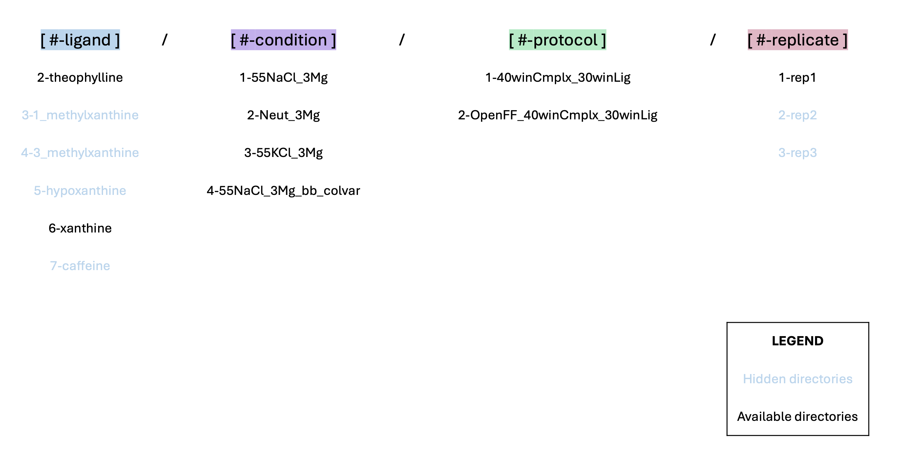

# Free energy calculations with RNA model with three Mg2+ ions

This directory contains equilibration and alchemical free energy calculations of theophylline and its analogs using BFEE2 Alchemical Route.
Calculations are performed in the presence of three structural Mg2+ ions.


## Directory Map ##

Directories were organized using the following structure:  `[#-ligand]/[#-condition]/[#-protocol]/[#-replicate]/`.
eg. For example the first replicate of the simulations of theophylline with RNA aptamer with 55 mM NaCl condition and 2 structural Mg2+ ions with our default alchemical protocol can be found in this path: `2-theophylline/1-55NaCl_3Mg/1-40winCmplx_30winLig/1-rep1/`.



We performed free energy calculations for all six ligands mentioned in the manuscript, however only directories of theophylline and xanthine are provided in this repository as examples (`2-theophylline/` and `6-xanthine/`). The setup of calculations of other analogs was exactly the same as the steps for xanthine. 

All free energy calculations were run as three independent replicates. Here, we provided the input files and scripts for only the first replicate (`1-rep1/`) to limit repository size. The other replicates were originally organized under separate directories in the same location (`2-rep2/` and `3-rep3/`).


```
.
├── 2-theophylline                                      : system directory for RNA-ligand complexes named by ligands
│   ├── 1-150KCl_Mg                                     : condition director (salt and Mg)
│   │   ├── 1-40winCmplx_30winLig                       : alchemical protocol directory (number of lambda windows)       						
│   │   │   ├── 1-rep1					: replica directory
│   │   │   │   └── 0-starting_PDB			: input PDB from RCSB database
│   │   │   │   └── 1-sys_prep  			: system preparation files
│   │   │   │   └── 2-sim_run   			: simulation directory
│   │   │   │   │   └── restraints 			: solute restraints file
│   │   │   │   │   └── equ_0   			: initial minmization and solute restrained simul.
│   │   │   │   │   └── equ_1   			: gradual release of the solute restraints
│   │   │   │   │   └── equ_2   			: unrestrained 100 ns equilibration
│   │   │   │   │   └── ini   				: pdb and psf after 100 ns equilibration to input to BFEE2
│   │   │   │   │   └── BFEE    			: BFEE files for alchemical free enegy calc.
│   │   │   │   │   ├── 001_MoleculeBound		: bound state : Forward-backward FEP calculations
│   │   │   │   │   │   └── output
│   │   │   │   │   ├── 002_RestraintBound		: bound state : TI for restraint contributions
│   │   │   │   │   │   └── output
│   │   │   │   │   ├── 003_MoleculeUnbound		: unbound state : forward-backward FEP calculations
│   │   │   │   │   │   └── output
│   │   │   │   │   └── 004_RestraintUnbound		: unbound state : TI for restraint contributions
│   │   │   │   │       └── output
│   │   ├── 2-80winCmplx                                : 80 windows for ligand-bound system
│   │   │   ├── 2-rep2					: next replica
.	.	.
│   ├── 2-150KCl                                        : next condition
.	.	.                                   
├── 6-xanthine                                           : next system with a different ligand
.	.	.    
├── 8-rna_RMSD_colvar_contr            : RNA only system for calculating contributions of RNA backbone restraints
├── common_files                       : common files and script templates are kept here
├── automation_scripts                 : scripts for setting up a group of calculations all at once
├── analysis                           : analysis of free energy calculations
│   ├── BFE_pandas                     : analysis of binding free energy predictions vs experiment
│   │   ├── analysis.ipynb             : calculate final estimates and plot predicted vs experimental free energies
│   ├── RDF                            : analysis of monovalent cation distribution
├── results                            : common files and scripts templates are kept here
│   ├── BFE_with_failed                : BFEE free energy results after removal of rejected replicates
```


## Simulated systems and conditions ##

### Ligands ###
| Directory Name      | Ligand                | Binding pose source                        | Charge   | 
| :----:              |    :----:             |    :----:                                    |  :----:    |
| 2-theophylline       | theophylline         | NMR structure of the complex                 | 0 |                                    
| 3-1_methylxanthine  | 1-methyl xanthine             | Align to theophylline binding pose           | 0 |
| 4-3_methylxanthine  | 3_methylxanthine              | Align to theophylline binding pose          | 0 |
| 5-hypoxanthine      | hypoxanthine                  | Align to theophylline binding pose   | 0 |
| 6-xanthine          | xanthine                     | Align to theophylline binding pose     | 0 |
| 7-caffeine           | caffeine                     | Align to theophylline binding pose     | 0 ||

### Conditions ###
| Directory Name              | Salt condition                | Structural Mg<sup>2+*</sup> ion               | Positional restraints                        |
| :----:              |    :----:                     |    :----:                     |    :----:                                    |
| 1-55NaCl_3Mg         | 55 mM NaCl | 3 Mg<sup>2+*</sup>|                     -                        |                                     
| 2-Neut_3Mg            | None | 3 Mg<sup>2+*</sup>                   |                     -                        | 
| 3-55KCl_3Mg         | 55 mM KCl | 3 Mg<sup>2+*</sup> |                     -                        |
| 4-55NaCl_3Mg_bb_colvar| 55 mM NaCl  |3 Mg<sup>2+*</sup>                  |  RNA backbone, ref: initial pdb positions                  |


<sup>*</sup>coordinating w/ (residue: 22-24) & (residues: 14-16) & (residues: 2-32)

## Protocols  ##

### A. Conda environments ###  
You can find the environment requirement files in: `../cond_envs`

### B. System set up ###

#### B.1. System set up for a single system
Necessary files for initial system preparation can be found in `1-sys_prep` directory for each system.

1) `0-add_Mg.tcl`: Places three Mg2+ on the RNA as described in the manuscript.

    `vmd -dispdev text -e 0-add_Mg.tcl`

2) `1-extract_lig_pdb_resname.tcl`: Changes resname of all ligands to "SML" (user needs to set the ligand resname as found in the pdb first).
Also, writes out separate pdb files for RNA and ligand.

    `vmd -dispdev text -e 1-extract_lig_pdb_resname.tcl`

3) `2-run_system_setup.sh`: Prepares the pdb and prmtop file using Ambertools. User needs to set the ligand charge in this file.
This file also reads in the "tleap.in" to build the system.

    `bash 2-run_system_setup.sh`

4) `3-gen_psf.py`: Generates psf file from pbd and prmtop files. The psf is not used for simulation purposes, but might be useful for visualization using VMD.

    `python 3-gen_psf.py`

5) For the free energy calculations, the last snapshot from the 100 ns unrestrained simulation (equ_2) is first extracted and then RNA is moved to the center 
of the box and water and ions are wrapped around it using `wrap.tcl`. There is a bash script, `run_wrap.sh`, to run this script
for all systems and replicas, found in the main directory. After running `wrap.tcl`, `ini/` directory is created in `2-sim_run/`
and `eq.pdb` and `eq.psfare` generated in there. We use `eq.pdb` as input for generating free energy calculations using BFEE2.
User must open the `eq.pdb` in a visualization software such as PyMol and check the structure to avoid the ligand being stretched across the periodic boundary.

6) Next step is generating input files for the FEP calculations using BFEE2 GUI. After [installing BFEE2](https://github.com/fhh2626/BFEE2#installation), X11 forwarding is used to run `BFEE2Gui.py` on the AWS instance using: `ssh -X USERNAME@Instance IP Address`.

7) After generating the input file using BFEE2, user needs to run "run_fix_ligOnly.sh", to neutralize the ligandOnly system. 


#### B.2. System setup for a group of systems and replicates.

We had to deal with a large number of systems to set up for each condition considering six ligands and three replicates each. To make file manipulation easier and parallel set up we used the utility scripts provided in `automation_scripts/` directory. Please note that these scripts were collected in this directory for tidiness. Their original location for execution is one folder up in `fe_calcs_with_3_mg/`. Before using them please remember to copy them one directory up to ensure the relative paths in the scripts function correctly.

#### B.3. Adding backbone restraints ###
To set the restraints user needs to run: ` source run_bb_colvar.sh`.

Inspect `run_bb_colvar_add_files.sh` to make sure the right equilibrium run file is referenced (`run_1_bb_colvar_equ.sh`). 
Check that `bb_colvars.in` is in the same directory as `equ_1/equ.0.conf` file. 
Make sure the absolute paths in `gen_index_group_MI.tcl` are corrected.  
Then run the following:
`conda activate bfee`  
`source run_bb_colvar_add_files.sh`  
This script adds two colvar lines to `equ_1/equ.0.conf`:
        `colvars on`
        `colversConfig bb_colvars.in`


### C. Running the simulations ###

All simulation files can be found in the `2-sim_run/` directory for each system.

Initially, each system is equilibrated in 3 steps: equ_0, equ_1, and equ_3. Before running these simulations, make sure the restraint file
is generated in the `restraints/` directory by running:

    `vmd -dispdev text -e restraints.tcl`

You can run the simulations in equ_0, equ_1, and equ_3, through the `run_1.sh` found in `2-sim_run/` directory.
The user can use "p3.2xlarge" instance for these equilibration steps.

Free energy calculations are set up using the BFEE2 tool:

For the default method of FEP and TI calculations, 40 and 30 windows are chosen (1-40winCmplx_30winLig), respectively for the complex and ligand-only systems.
In some cases we explored deviations to lambda protocol, such as doubling the lambda windows or sampling.
For all ligands and for only the condition: {1-150KCl_Mg}, we ran only the ligand-bound system with 80 windows (2-80winCmplx)

Free energy calculations can be submitted to "g5.4xlarge" instances for running with NAMD.


### D. Analysis ###

To get the free energy results from BFEE2 use:  
`conda activate bfee`  
`python post_treatment_pandas_failed_rep.py`  

#### D.1. Analysis of simulations with RMSD backbone restraints
For RMSD backbone restraints analysis do the following change:    
`vi /opt/install/conda/envs/bfee/lib/python3.11/site-packages/BFEE2/postTreatment.py`    
Go to line 348:    
change the following lines:    
`348         if rigidLigand:  
349             numCVs = 6  
350         else:
351             numCVs = 7`   
to:  
`348         if rigidLigand:  
349             numCVs = 6  
350         else:  
351             numCVs = 8`   

#### D.2. Analysis of high occupancy sites for monovalent cations
Ion density analysis steps:  
Run `run_ion_density.tcl` in the main directory:  
`bash run_ion_density.tcl`  
Then go to where densities are saved:  
`cd results/ion_density_scaled`  
and run `avg_density.tcl` to get the average densities:  
`vmd -dispdev text -e avg_density.tcl`  
